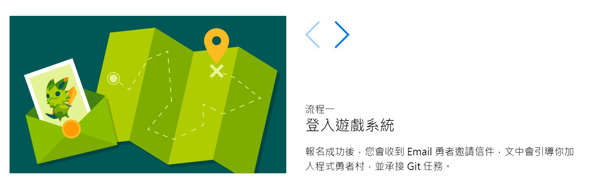
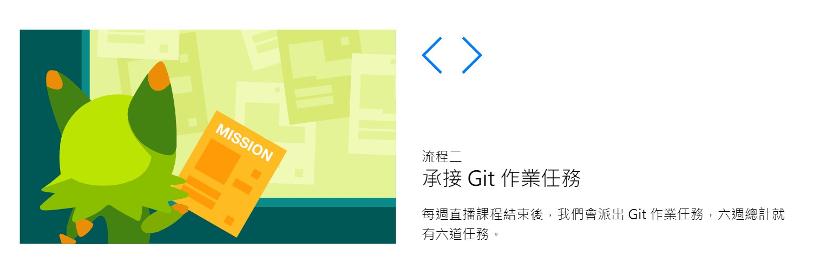
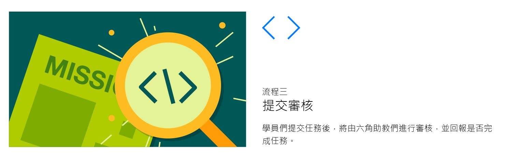
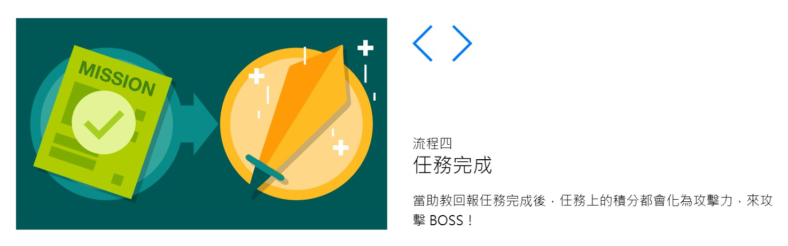
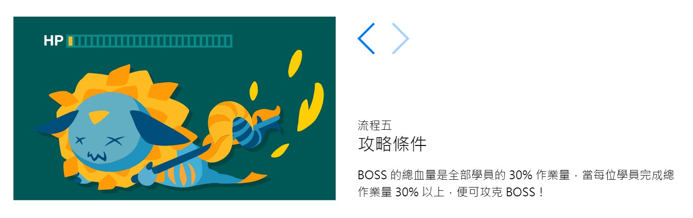

# README

這是我參加「六角學院 - Git特訓直播班 - 2020秋季班」的課堂筆記，  
將會記錄我過程所學的git版本管理知識與操作。

影片的部分因為是六角學院擁有，所以不會上傳，歸納的課堂筆記重點，會是我自己整理與操作的過程。  
未來如果做教學或傳承時，可以進一步反覆複習、練習與使用。

<!-- TOC -->

- [README](#readme)
  - [正式授課內容](#正式授課內容)
  - [團戰遊戲任務系統](#團戰遊戲任務系統)
  - [Folder Structure](#folder-structure)
  - [課前預習](#課前預習)
  - [END](#end)

<!-- /TOC -->

--

**reference:**

- 課程網址: [Git 特訓直播班 | 六角學院](https://www.hexschool.com/courses/git-training.html)
- 教學日期: 2020/9/11 ~ 9/30
- 授課堂數: 9/11(五)、9/16(三)、9/18(五)、9/25(五)、9/30(三)
- 授課時段: 各授課堂數的 20:00 ~ 22:30
- 教學時數: 每堂 2.5 小時，共 5 堂，總計 12.5 小時
- 直播教室: 使用 ZOOM 進行直播教學
- 預習網址: [六角學院](https://courses.hexschool.com/courses/enrolled/1078432)

---

## 正式授課內容

- 第一週: Git 基礎再打穩。
  - 本門課程會從最基礎的 Git 環境安裝、終端機配置、指令來進行教學，讓您能從零開始學習！
  - 實作主題: 將網頁部署到 GitHub Pages 網頁空間
  - 教學關鍵字: git init、git add、git commit、repository
- 第二週: Git 遠端儲存庫操作大全。
  - 市面上有很多得 Git 遠端儲存庫服務，例如 GitHub、Bitbucket、GitLab 等等，為了讓各位同學了解遠端儲存庫的操作方式，本堂課挑選 GitHub、Bitbucket 來分享，同時會安排團隊一起玩 Git，讓您親身體驗團隊協作流程！
  - 實作主題: 小組操作 GitHub Issue、團隊協作流程
  - 教學關鍵字: git push、git pull、git remote、GitHub、Bitbucket
- 第三週: Git 分支管理術。
  - 多數人沒學好 Git ，主要都是卡在分支(branch) 練習得不紮實，本堂課會鉅細靡遺地講解分支，同時會備好大量的題目，讓您進行反覆觀念，一次貫通 Git 觀念！
  - 實作主題: 分支團隊協作、大量分支題目練習
  - 教學關鍵字: git branch、git merge、快轉模式(fast-forward)、HEAD
- 第四週: Git 分支還原與衝突。
  - 寫程式不可能永遠一帆風順，版控亦是如此，本堂課會分享常見的 Git 還原與衝突解決方式，讓您遇到各種狀況都能無往不利，談笑風生決實務問題！
  - 實作主題: 提供各式小劇場題庫，讓您反覆練習真實情況
  - 教學關鍵字: git reset、git checkout、git reflog、merge 衝突解決
- 第五週: Git Rebase、PR 團隊協作流程
  - Git Rebase 是業界團隊常見的工作流程，為了讓 Git 線圖能夠整理成簡單易讀的方式，你不可不會 Rebase 技巧，本堂課將會講解常見Rebase 開發流程，讓您能對此開發流程有更深入的了解~
  - 實作主題: 親自與您的小組一同演練 GitHub Flow 工作流程
  - 教學關鍵字: git rebase、cherry pick、分支操作流程

---

## 團戰遊戲任務系統

--

  
  
  
  

--

## Folder Structure

資料夾結構如下

- video/: 學習影片
- receipt_feedback_content/: 購買課程之大綱與發票紀錄，外加公司要求的心得文件。
- learning_notes/: 學習筆記

---

## 課前預習

在正式課程之前，廖淯杰老師已經有先提供預錄好的預習影像課程，  
可以做初步的學習與認識，讓後續的學習速度更快、認識更全面。

1. 預習影音檔已上傳。  
2. 已設計五道練習題，預期每個練習題僅需要花費 30~60 分鐘就可做完，方便大家依照自己節奏學習。  
3. Slack 助教服務也已開放，有問題可以隨時 que 我們來提問，本班的講師與助教為 @我、@Ray 與 @穎旻 助教~
4. 接下來每週都會依照學員學習情況，來設計各種題型，讓各位同學可以在課前有充分準備

PS：如果你沒時間提前預習也沒關係，第一堂課也會從最基礎開始講解的，也祝各位小週末愉快勒 :D

**預習課程內容:**

- Git 環境安裝與命令提示字元
  - ⏯ 為什麼要學Git (11:49) 
  - ⏯ 安裝流程 (1:24)
  - ⏯ 終端機指令 cd 前往 (4:00)
  - ⏯ 新增 repo 與環境設定 (12:45)
  - ⏯ 常用終端指令分享 (2:19)
  - 📖 小節作業：環境設定確認
- 課前預習 - Git 基本指令介紹
  - ⏯ Git 基本操作教學 (16:25)
  - 📖 小節作業：Git 指令練習
  - ⏯ Sourcetree軟體教學 (9:52)
  - 📖 小節作業： Sourcetree 操作
  - ⏯ 新增遠端數據庫 (repo) (15:33)
  - 📖 小節作業：新增遠端數據庫
  - ⏯ 回顧練習 (15:00)
  - ⏯ Git 指令縮寫 (4:38)
  - 📖 小節作業：Git 指令縮寫
- 遠端數據庫操作教學
  - ⏯ Git、GitHub 差異 (1:17)
  - ⏯ Git Repository 中文翻譯 (0:31)
  - ⏯ 遠端數據庫詳解 (2:42)
  - ⏯ Bitbucket 服務介紹 (29:46)
  - ⏯ HEAD 指標、checkout 前往 (6:27)
  - ⏯ 遠端數據庫線圖介紹 (12:53)

---

## END
