# 01_Git環境安裝與命令提示字元

課堂講義: [Git & GitHub 入門 - Quip](https://quip.com/pFUnA7u75HbL)

<!-- TOC -->

- [01_Git環境安裝與命令提示字元](#01_git環境安裝與命令提示字元)
  - [01_為甚麼要學Git](#01_為甚麼要學git)
  - [02_安裝流程](#02_安裝流程)
    - [安裝設定過程](#安裝設定過程)
    - [安裝成功畫面](#安裝成功畫面)
  - [03_終端機指令cd前往](#03_終端機指令cd前往)
  - [04_新增repo與環境設定](#04_新增repo與環境設定)
  - [05_常用終端指令分享](#05_常用終端指令分享)
  - [END](#end)
    - [幫忙解決問題補充](#幫忙解決問題補充)

<!-- /TOC -->

---

## 01_為甚麼要學Git

版本比較好管理，可以輕易地看到變更了哪些檔案，以及變更了甚麼？  
另外，透過 source tree 的軟體(不用軟體單用指令也行)，也可以輕易的回到之前開發的版本紀錄時間點，觀看當時的檔案。

所以有人稱 git 是時光機，透過版本紀錄，可以回復當時操作的記憶XD~

## 02_安裝流程

- [圖形化介面工具 - 為你自己學 Git | 高見龍](https://gitbook.tw/chapters/environment/gui-tools.html)
- [Git - GUI Clients](https://git-scm.com/downloads/guis/)

查了一下，常用的 GUI(Graphic User Interface) 工具很多，資源上這下面兩種底較常見。

- github desktop
- source tree

下載 SourceTree 進行安裝，完成後會要求登入一個叫做 Bitbucket 的服務，  
所以簡單介紹一下整個組織。

--

**Atlassian - Trello、Bitbucket:**

認識 [Atlassian - 維基百科，自由的百科全書](https://zh.wikipedia.org/wiki/Atlassian)。  
可從這裡登入 [Atlassian](https://start.atlassian.com/)。

有一家澳大利亞軟體企業公司 - 艾特萊森軟體(Atlassian)，主要為軟體開發者及項目經理設計軟體，  
這公司的主力產品為專門用作追蹤應用程式問題的JIRA，還有用作協作團隊的產品Confluence，但是近年來逐漸收購了很多的軟體服務。

- Bitbucket: 基於web的版本庫代管服務，於 2010 年被 Atlassian 收購。
- Trello: 2017年1月13日，Atlassian 收購。

Atlassian login 畫面:

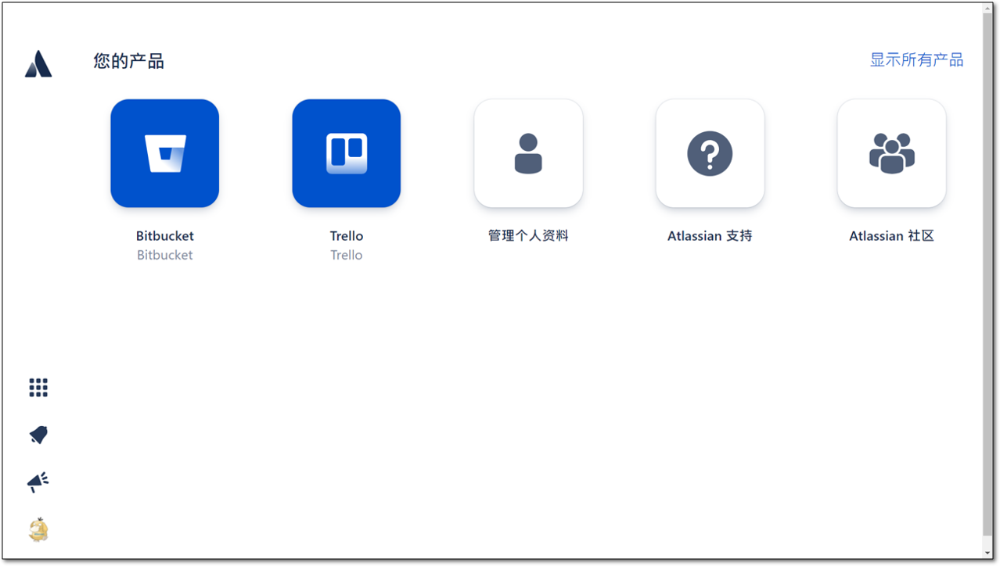

Bitbucket login 畫面:

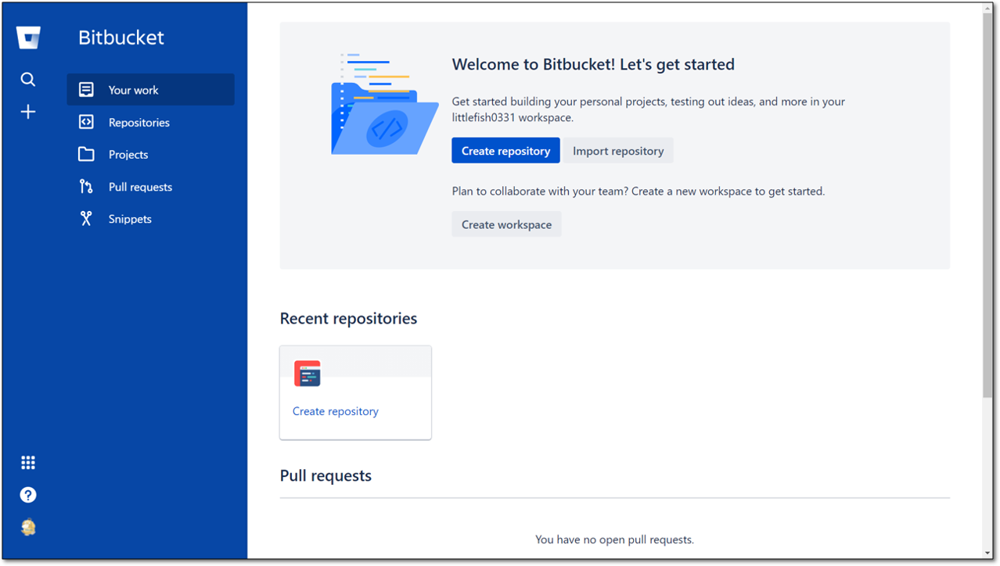

--

### 安裝設定過程

01-Install: 如果有 Bitbucket 帳號就登入，沒有也沒關係，按個 skip 就好。而 BitBucket Server 則是公司有自己架設 Birbucket 的話，可以點選此選項。  
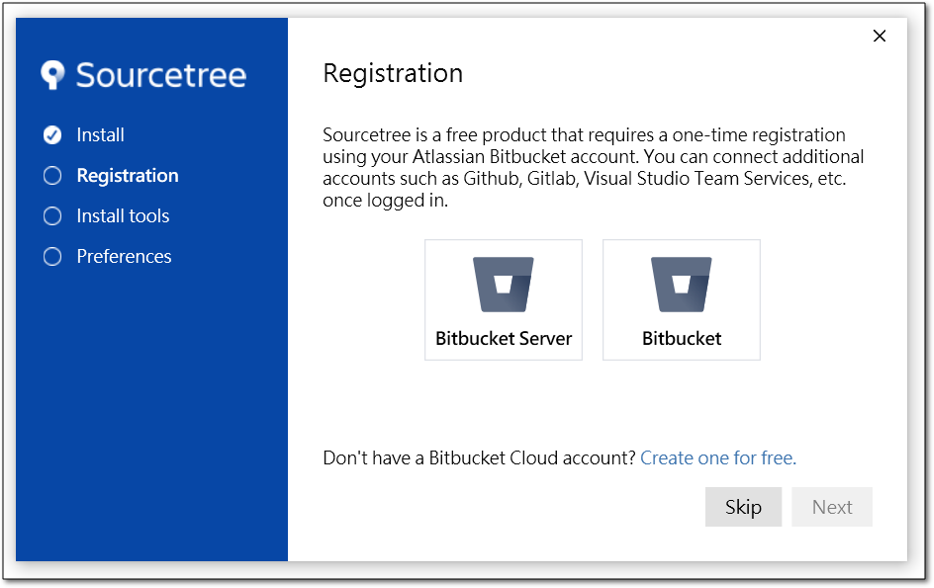

點選 Bitbucket 會跳出瀏覽器要求權限，按下 grant access。  
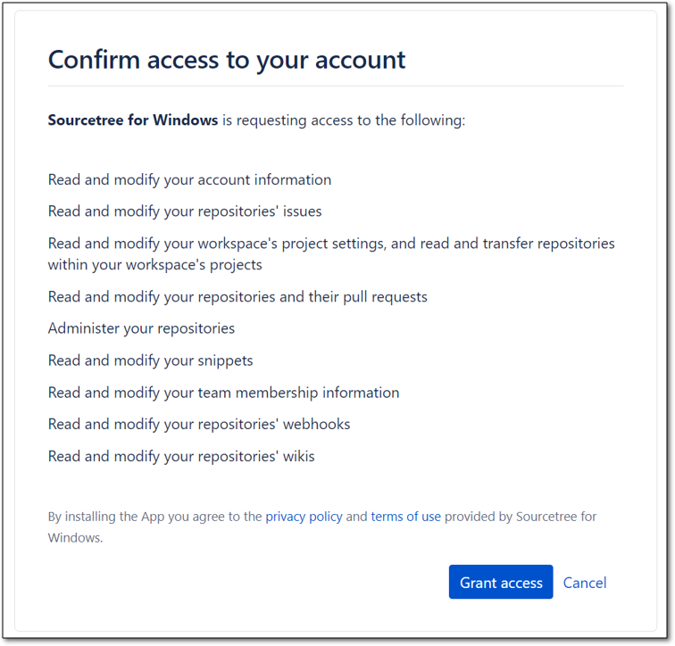

Registation Complete  
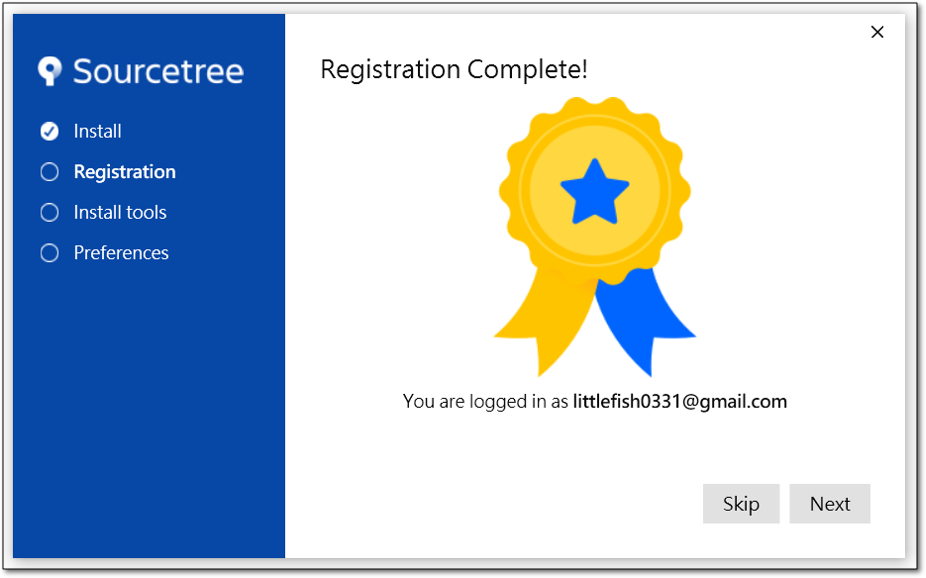

02-Registraion: 會提供將使用的工具選項，要求 download 和 install。  

> **[Mercurial - 維基百科，自由的百科全書](https://zh.wikipedia.org/wiki/Mercurial):**
>  
> Mercurial 是跨平台的分散式版本控制軟體，主要由 Python 語言實現，但也包含用 C 語言實現的二進位比較工具。  
> 一開始的主要執行平台是 Linux，現在已經移植到 Windows、Mac OS X 和大多數的類Unix系統中。  
> Mercurial 主要由命令行程式組成，現在也有了圖形化使用者介面。  
> 對 Mercurial 的所有操作都由用不同的關鍵字作為參數呼叫程式「hg」來實現，Hg 是參考水銀的化學符號而取的名字。
>  
> 簡單來說，Mercurial 和 Git 功用相同。目前主流是 Git。(但記得，主流不代表功能強大或是豐富，網路上有兩者的論戰)

會自動偵測電腦 git 安裝的位置，可以取消勾選 Mercurial。  
Advance Optional: 可以暫時都不要勾選。  
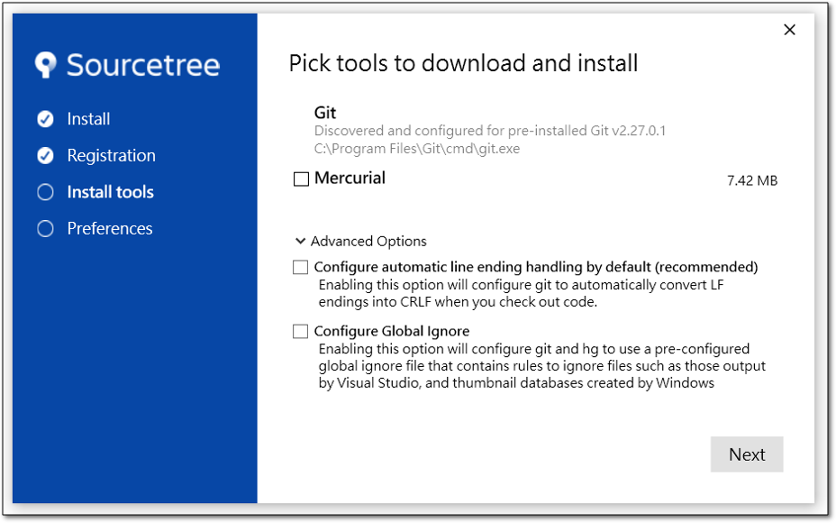

03-Install Tools: 輸入使用者名稱和電子信箱。
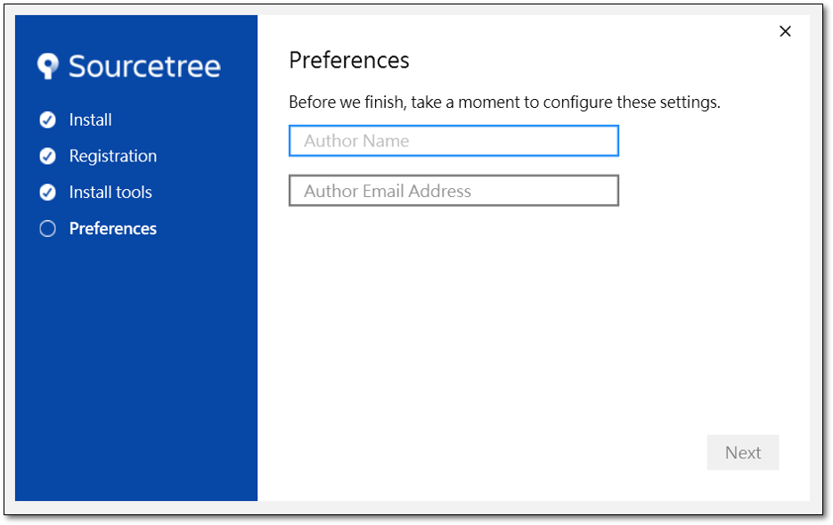

04-Preference: 會跳出視窗詢問是不是要 load SSH key，如果有可以按 Yes 上傳，不然點選 No 即可。
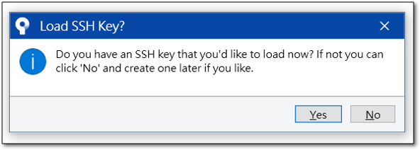

--

### 安裝成功畫面

安裝成功畫面如下。  
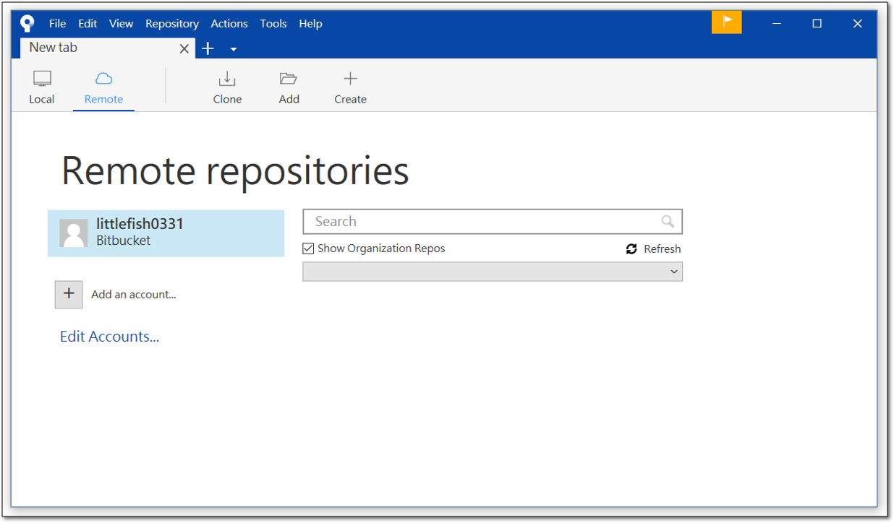

如果要 load SSH Key。  
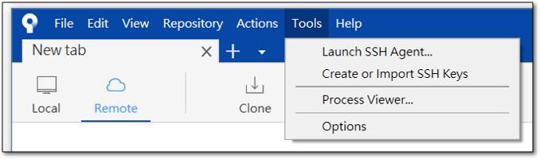

新增帳戶。  
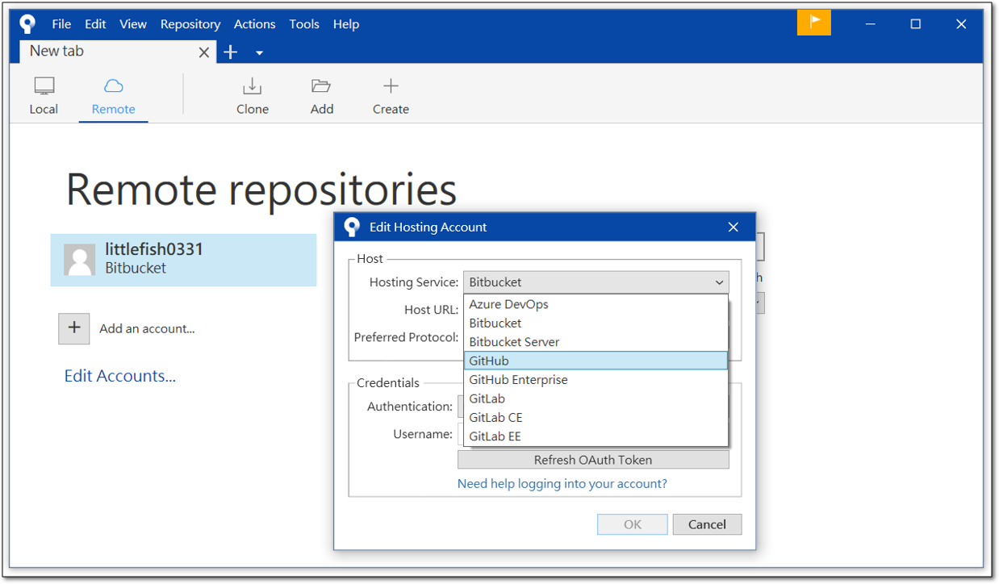

查看 gitconfig。  
Tools > Options > General。  
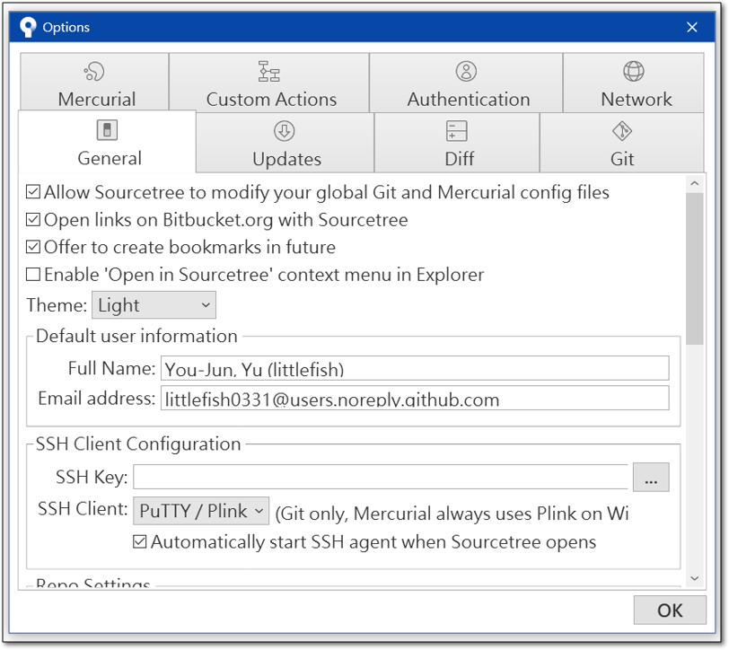

查看 Authentication。(SourceTree 自動偵測出來的設定檔案)  
Tools > Options > Authentication。  
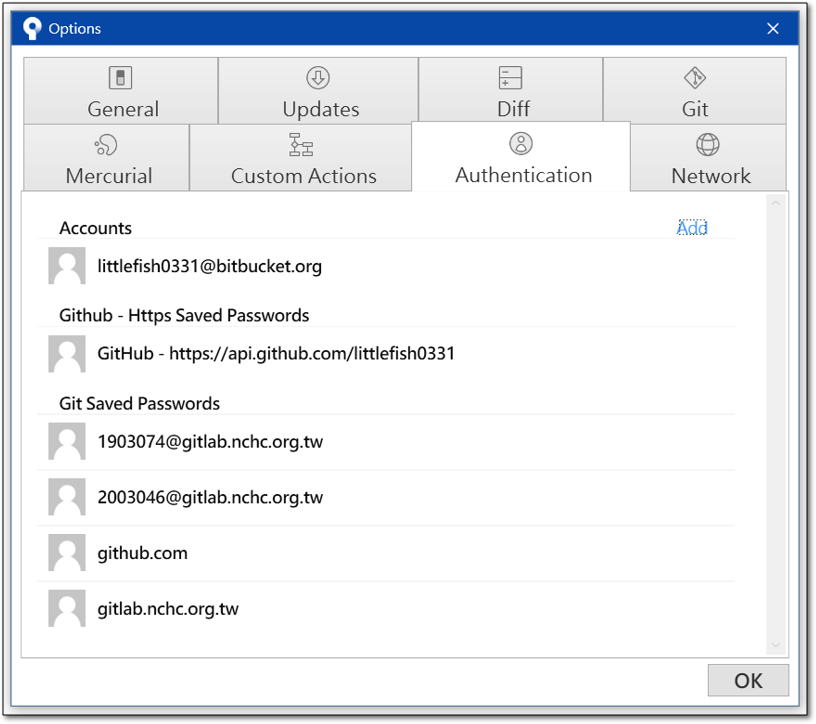

---

## 03_終端機指令cd前往

不要害怕學習 linux 指令，慢慢操作熟練就好。  
cd 到指定的工作目錄下，可以用 drag(拖拉)的方式。

---

## 04_新增repo與環境設定

`git init`: 初始化一個專案。即我要新增一個數據庫，我要開始使用 git 了。  

> Initialized empty Git Repository in ...  

接著工作目錄底下就會有一個 .git/ 的隱藏資料夾。

--

`git --version`: 顯示 git 的版本。

--

設定個人檔案，因為 git 做版本控制，要知道是誰推上去現在的版本，也就是紀錄現在是誰在更新。  
或者可以新建 C:/Users/littlefish/.gitconfig 做設定。  
如果下面設定有輸入錯，指令重打即可。

- 輸入姓名: `git config --golobal user.name "littlefish0331"`
- 輸入個人的 email: `git config --golobal user.email "littlefish0331@gmail.com"`
- 查詢 git 設定內容: `git config --list`

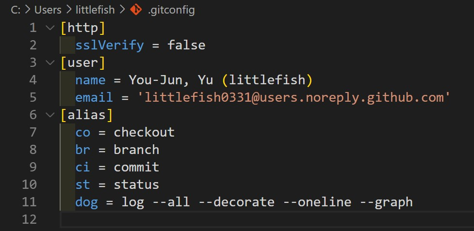

:::danger
世界上最可怕的事情，
就是你寫了爛 code，然後幫你維護的人還知道了你的地址XD
:::

--

Q: email 可以不輸入嗎?  
A: 印象中市都要輸入。

Q: list 檢視完，要如何回到指令狀態?  
A: 按小寫的 q 即可退出。但 windows 好像沒有這問題XD

Q: mac terminal 很漂亮，是使用哪一個?
A: 老師是用 item2 + oh-my-zsh 的配色，再加一些調整。

Q: 如何檢視隱藏資料夾?  
A: [Win 開啟隱藏檔方式](https://helpx.adobe.com/tw/x-productkb/global/show-hidden-files-folders-extensions.html)、[Mac 開啟隱藏檔方式](https://blog.vvtitan.com/2019/02/mac-os-x%E9%A1%AF%E7%A4%BA%E6%88%96%E9%9A%B1%E8%97%8F%E9%9A%B1%E8%97%8F%E6%96%87%E4%BB%B6/)

---

## 05_常用終端指令分享

- [小技巧-cmd常用命令之建立檔案 - IT閱讀](https://www.itread01.com/p/1389119.html)

windows 新增檔案可以用 `cd . > file.txt`

> `cd .`表示改變當前目錄為當前目錄，即等於沒改變，所以此命令不會有輸出。  
> `>`表示把命令輸出寫入到檔案。後面跟著 file.txt，就表示寫入到 file.txt。  
> 而此例中命令不會有輸出，所以就建立了沒有內容的空檔案。

---

## END

### 補充

超全域找檔案指令。

```{bash}
find / -xdev 2>/dev/null -name "exampledocs"
```

### 幫忙解決問題補充

Bitbucket 和 Github 的功能差不多，可以簡單想成都是程式碼托管平台。所以你也可以去註冊一個 Bitbucket 的帳號。

而分成 Bitbucket 和 Bitbucket server，後者是你自己使用 Bitbucket 搭建的伺服器，有點類似公司不想把程式碼丟到網路上托管，所以在公司的 server 上，建立 Bitbucket 的服務。

總結，這一步就可以不管 skip 就好XD~

p.s. Bitbucket 隸屬於 Atlassian 這家軟體公司，所以你註冊時會導到這個公司的頁面不用太緊張。Atlassian 還有提供很多不同的服務(如: trello等等)。

--

不是助教，但是經驗分享給參考。

1.  
這一小節教學(git init, git config, git --version)，指令順序或是打錯，都可以重新輸入。

2.  
git init 如果打兩次，應該會看到不同的提示訊息。  
至於差異在哪裡，到後面的實作，再交給老師或助教解釋XD~ 

```
D:\project>git init
Initialized empty Git repository in D:/project/.git/  <-- Initialized 表示初始化。

D:\project>git init
Reinitialized existing Git repository in D:/.git/  <-- Reinitialized 表示"重新"初始化。
```

git config --global，其實 global 代表全域設定，如果是 windows 可以去下面路徑找到設定檔 C:/Users/<使用者名稱>/.gitconfig。

git init 和 git config，兩個指令不衝突，前者說明初始化這個專案資料夾，也就是新增數據庫開始追蹤專案下的檔案變更。  
git config 的設定則是當你要 更新/推上去 專案時，會告訴 git 這次更新的 user name 和 user email 是什麼?

p.s. 如果要每個專案資料夾更新時有不同的 user name 和 user email，可以去看看 git config --local 怎麼使用。

3.  
不需要，如果專案已經初始化過，在打開專案時，/.git/ 這個隱藏資料夾還是會在。但是如果是有新的專案資料夾，則依舊要 `git init`。  
git config --global 的設定，做一次就好，你可以隨意到新的專案資料夾底下，輸入 `git config --list`，都可以看到之前設訂好的 user name 和 user email。

---
