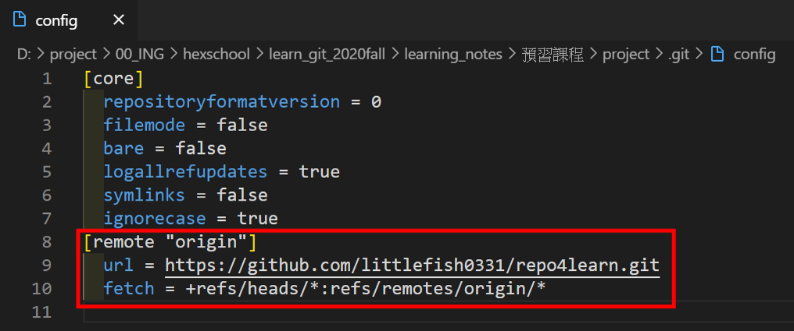

# 02_課前預習-Git基本指令介紹

課堂講義: [Git & GitHub 入門 - Quip](https://quip.com/pFUnA7u75HbL)

---

## 01_Git基本操作教學

cmd 的編碼會有點問題，所以部分用 wsl:ubuntu 的環境截圖操作。

index.html 尚未加入索引前。  


新增 index.html。  


css/all.css 尚未加入索引前。  


新增 css/all.css。  


觀看 log，可以知道檔案更新的歷程，以及作者是誰，他的name, email，以及更新的時間。
  


---

## 02_Sourcetree軟體教學

- Sourcetree 可以用點擊的方式取代指令，但指令還是很重要唷!
- 隱藏檔 .git，可以翻譯成數據庫或是儲存庫。

--

Add > Browse。  


--

用 SourceTree 實際操作一遍。  
做好的檔案會在介面上，顯示 Uncommitted Changes 在最上方，並且這些修改後的檔案，或是說修改後的紀錄，目前還在工作目錄的階段。  


--

點擊要追蹤的檔案，按下「Stage All」，就完成了 `git add .` 的工作。也可以一個一個檔案新增「Stage Selected」或是「+」。


--

此時要 commit 新增好的索引，就點擊上方的 Commit 功能。  
這個操作等同於 `git commit -m "新增標題標籤"`。  


---

## 03_新增遠端數據庫(repo)

現在要把這三個 commit 紀錄，push 到遠端數據庫。  
首先，要先新增遠端數據庫。

1. 到 github.com
2. 右上角「+」 > 「New repository」。這個步驟等同於 `git init`
3. 提供兩種方式，在本地端建立新的數據庫並與此遠端數據庫連結；將本地端的數據庫與此遠端數據庫連結。選擇後者。

```{bash}
git remote add origin https://github.com/littlefish0331/repo4learn.git
git push -u origin master
```

git remote add 指令下完後，可以去 .git/config 觀看建立連結的遠端數據庫路徑。


將本地數據庫 push 到遠端數據庫。  


> 可能會要輸入 github 帳號密碼。

4. 完成後可以到 github repository 上觀看，注意到有「3 comits」的訊息。


--

將剛剛寫的 index.html 在抗面變成一個可以觀看的網頁。  
Settings > Github Pages > Source:master > Save，  
完成後，最上方會有訊息「GitHub Pages source saved.」，  
剛剛的設定位置也會有訊息「Your site is ready to be published at https://littlefish0331.github.io/repo4learn/.」

我的成果: [Document](https://littlefish0331.github.io/repo4learn/)

--

練習新增副標題h2。


從 SourceTree 可以知道，  

- master: 本地端數據庫的位置。
- origin/master: 遠端數據庫的位置。

本地端的東西，在尚未更新上去之前，是不會影響到遠端的。  
所以目前本地端的 commit數為4，遠端的 commit數為3。


利用 SourceTree，將新增的副標題 push 上去。


---

## END
